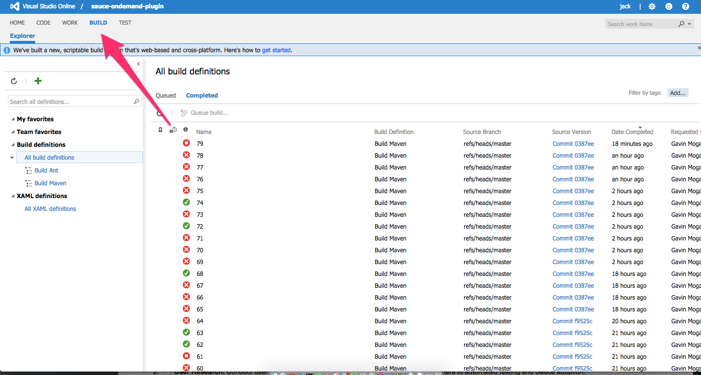
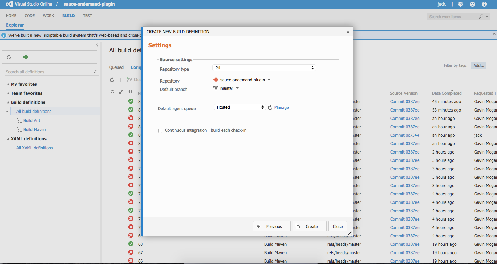
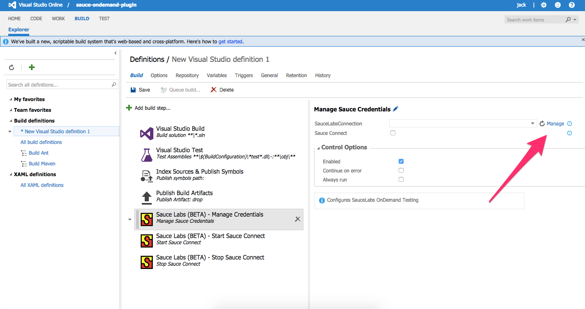

## Sauce Labs Plugin for VSO Overview

Sauce Labs is a platform for running your Selenium and Appium scripts in the cloud. Sauce Labs gives users the ability to run on over 600 browser/platform combinations from IE6 on Windows XP to Safari 9 on OSX El Capitan to Chrome the Samsung Galaxy S5. Cloud execution means massive parallelization so you can finish your automated tests in minutes rather than hours. 

The Sauce Labs Plugin for VSO allows users to easily authenticate on Sauce Labs as a part of the VSO build process. The plugin also allows users to launch Sauce Connect - a tunnel that allows customers to securely test pre-production apps. 

## Basic Setup

To get started visit the Build tab on your VSO Dashboard. 

Next add a __Build Definition__. Select the relevant template for your project. In this example, we'll select a Visual Studio template.

Configure your source code settings and select "Hosted" for the __Default agent queue__. Click "Create" when finished.

Now click __Add build step__ to get a list of tasks you can add. Search under "Utility" to find three Sauce Labs related tasks that you can add. You will want to install all three but the order is important. First, add the Sauce Labs "Manage Credentials", then "Start Sauce Connect", and finally "Stop Sauce Connect".

### Manage Credentials

The "Manage Credentials" task is what allows you authenticate with your Sauce Labs account via VSO. Click __Manage__ next to the SauceLabsConnection dropdown to create a new service endpoint which will contain your Sauce Labs username and access key. 

Create a new "Generic" service endpoint and enter your Sauce username and API key. Note you will also need to give the connection a name - something like "firstname_lastname" will work. You will also need to input "https://www.saucelabs.com" as the Server URL. 

Return to the Manage Credentials task and select the SauceLabsConnection that you just created. Ensure that the task is "Enabled" under __Control Options__.

### Start Sauce Connect (Optional)

Sauce Connect is a secure tunneling app which allows you to execute tests securely when testing behind firewalls via a secure connection between Sauce Labs’ client cloud and your environment. 

You should use Sauce Connect whenever you’re testing an app behind a firewall. Sauce Connect is not required to execute scripts on Sauce.

Adding this task will automatically launch a Sauce Connect tunnel for you whenever a build starts and authetnicate with the credentials you have input above. 

# Gavin does the user need to have anything installed anywhere in particular? ^^^^^

Ensure that the Start Sauce Connect task is "Enabled". You can also specify whether this task should __Always run__ and/or __Continue on error__.

### Stop Sauce Connect

Finally, if you are using Sauce Connect as described in the previous step, you will want to ensure that the tunnel is shut down after the build. To do this simply add the "Stop Sauce Connect" task and ensure that it is "Enabled". We recommend setting this task to __Always run__. 

### Running Tests

The actual running of your automated tests is handled by your build tool or test runner. This will be different depending on what programming language you are using. For Java, you may opt to use Maven for example. For more information about writing and running automated tests on Sauce Labs, please visit: https://docs.saucelabs.com/. 
