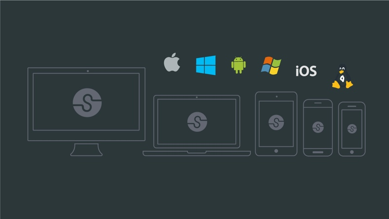
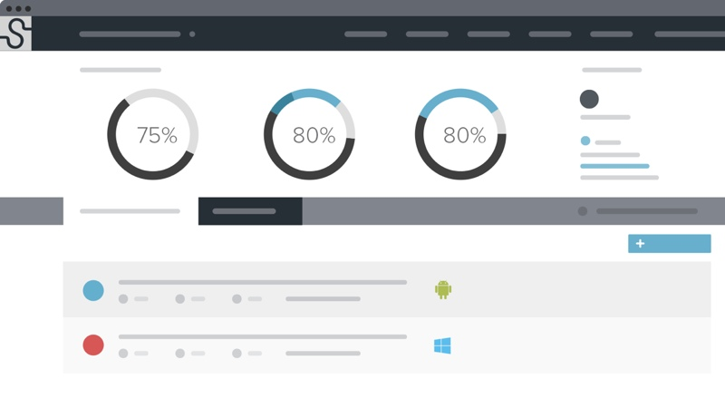
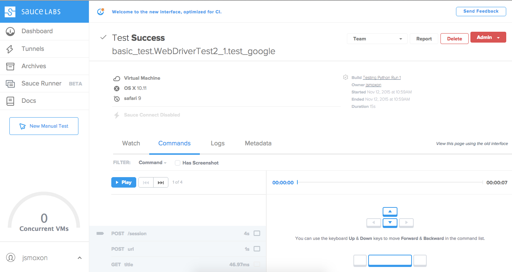

## Sauce for Visual Sudio Online (Preview) Overview

The Sauce for Visual Studio Online (VSO) enables Continuous Delivery by speeding up the testing cycle while increasing the quality of mobile and desktop applications.

Sauce Labs provides a platform for running your Selenium and Appium scripts in the cloud. Run tests on over 650 browser/platform combinations from IE6 on Windows XP to Safari 9 on OSX El Capitan to the latest versions of Andriod and iOS. Cloud execution means massive parallelization so you can finish your automated tests in minutes rather than hours. 

To get started [signup for a Sauce Labs free trial](https://saucelabs.com/beta/signup?utm_source=vsip).

The Sauce for VSO allows users to easily authenticate on Sauce Labs as a part of the VSO build process. The plugin also allows users to launch Sauce Connect - a tunnel that lets customers securely test pre-production apps. 

## Features

Easily scale to speed up test cycles and boost capacity without the hassle of managing infrastructure. Run your Selenium and Appium scripts to test your desktop and mobile apps. 

### Get results faster
After your tests are completed, Sauce Labs provides a full report of the run with videos and screenshots, metadata, Selenium and console logs, and a complete list of commands and responses.

### Leverage existing tools
Compatible with tests written in any language and framework. Use any test runner to run tests. Integrate your CI system to make automated testing a part of your build process.

### Pinpoint issues easily
Flip through screenshots taken after each page-altering command to diagnose errors and verify layout. Or, watch a video recording of the whole test from start to finish.

### Test securely in the cloud
All tests are run in our secure data center on brand new VMs that are destroyed after each run, assuring customer data is never exposed to future sessions. Control proxy and access policies while testing staged applications behind a firewall with [Sauce Connect](https://wiki.saucelabs.com/display/DOCS/Using+Sauce+Connect+for+Testing+Behind+the+Firewall+or+on+Localhost), our secure tunneling technology. 

### Take control
While tests are running, you'll have access to a live remote desktop session. You can manually take control of the VM (to, say, clear a popup that's blocking your test), or "breakpoint" the test to stop your test session and investigate a problem manually.
